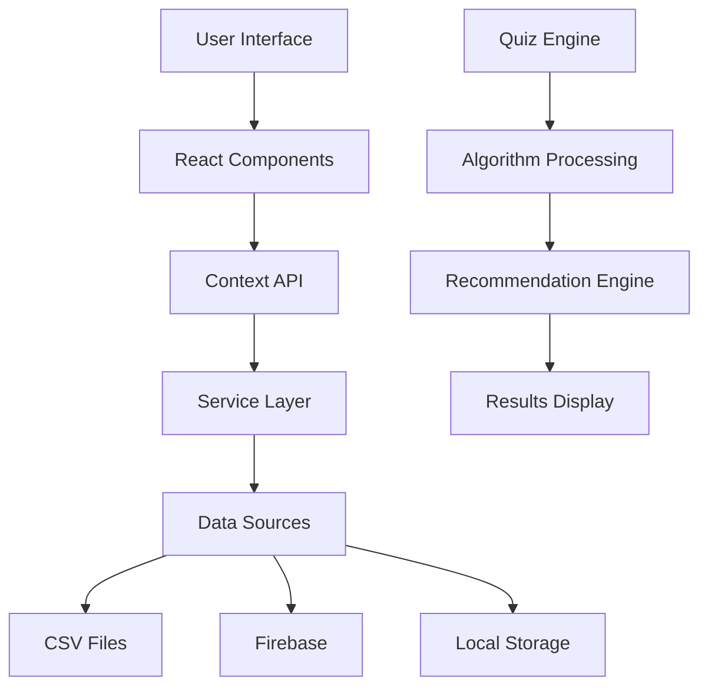

# 🚀 CareerCompass Technical Stack Roadmap

## 📋 Table of Contents
1. [Current Technology Stack](#current-technology-stack)
2. [Architecture Overview](#architecture-overview)
3. [Frontend Technology Deep Dive](#frontend-technology-deep-dive)
4. [Development Tools & Configuration](#development-tools--configuration)
5. [Data Management & Services](#data-management--services)
6. [Phase-wise Implementation Roadmap](#phase-wise-implementation-roadmap)
7. [Scalability & Future Enhancements](#scalability--future-enhancements)
8. [Performance Optimization](#performance-optimization)
9. [Security & Best Practices](#security--best-practices)
10. [Deployment Strategy](#deployment-strategy)

---

## 🏗️ Current Technology Stack

### **Frontend Core**
```javascript
{
  "framework": "React 18.2.0",
  "buildTool": "Vite 4.5.0", 
  "styling": "Custom CSS + Tailwind CSS",
  "stateManagement": "React Context API",
  "routing": "React Router DOM 6.30.1",
  "icons": "Lucide React 0.542.0",
  "language": "JavaScript (ES6+)"
}
```

### **Development & Build Tools**
```javascript
{
  "packageManager": "npm",
  "bundler": "Vite (Rollup-based)",
  "linting": "ESLint 9.33.0",
  "hotReload": "Vite HMR",
  "devServer": "Vite Dev Server",
  "buildTarget": "ES2020",
  "moduleSystem": "ES Modules"
}
```

### **Backend & Data Services**
```javascript
{
  "authentication": "Firebase 12.2.1",
  "database": "Firebase Firestore",
  "dataStorage": "Local JSON + CSV parsing",
  "apiLayer": "Custom Service Classes",
  "stateSync": "React Context + Local Storage",
  "fileHandling": "CSV parsing service"
}
```

---

## 🎯 Architecture Overview

### **Component Architecture**
```
📦 CareerCompass Architecture
├── 🎨 Presentation Layer
│   ├── React Components (UI)
│   ├── Custom CSS Modules
│   ├── Tailwind Utilities
│   └── Responsive Design
├── 🔄 Business Logic Layer  
│   ├── React Context (State)
│   ├── Custom Hooks
│   ├── Utility Functions
│   └── Quiz Logic
├── 📊 Data Layer
│   ├── Service Classes
│   ├── CSV Data Parser
│   ├── Firebase Integration
│   └── Local Storage
└── 🚀 Infrastructure
    ├── Vite Build System
    ├── ESLint Configuration
    ├── Development Server
    └── Production Build
```

### **Data Flow Architecture**


---

## 🎨 Frontend Technology Deep Dive

### **React 18.2.0 Features Used**
```javascript
// Modern React Patterns Implemented
const techFeatures = {
  hooks: [
    "useState",           // Component state management
    "useEffect",          // Side effects & lifecycle
    "useContext",         // Global state access
    "useReducer",         // Complex state logic
    "useMemo",           // Performance optimization
    "useCallback"        // Function memoization
  ],
  
  patterns: [
    "Functional Components",     // Modern component style
    "Custom Hooks",             // Reusable logic
    "Component Composition",    // Flexible architecture
    "Controlled Components",    // Form handling
    "Error Boundaries",         // Error handling
    "Lazy Loading"             // Performance optimization
  ],
  
  contextAPI: {
    provider: "AppProvider",
    consumers: "useApp hook",
    globalState: [
      "user profile",
      "quiz results", 
      "navigation state",
      "college data"
    ]
  }
};
```

### **Vite 4.5.0 Build System**
```javascript
// Vite Configuration & Features
const viteFeatures = {
  development: {
    hotReload: "Instant HMR",
    devServer: "Lightning fast",
    esModules: "Native ES modules",
    preprocessing: "On-demand compilation"
  },
  
  build: {
    bundler: "Rollup",
    optimization: "Tree shaking",
    codesplitting: "Dynamic imports",
    minification: "Terser",
    assetOptimization: "Built-in"
  },
  
  plugins: [
    "@vitejs/plugin-react",    // React support
    "Hot reload",              // Development experience
    "Asset handling",          // Static files
    "CSS preprocessing"        // Style processing
  ]
};
```

### **Styling Architecture**
```css
/* Styling Stack Breakdown */
.styling-architecture {
  /* 1. Custom CSS Variables */
  --primary-color: #3b82f6;
  --secondary-color: #22c55e;
  --gradient-primary: linear-gradient(135deg, #3b82f6, #8b5cf6);
  
  /* 2. Tailwind CSS Utilities */
  @apply bg-gradient-to-r from-blue-600 to-purple-600;
  
  /* 3. Component-Specific Styles */
  .quiz-container { /* Custom component styles */ }
  .results-card { /* Styled components */ }
  
  /* 4. Responsive Design */
  @media (max-width: 768px) { /* Mobile-first approach */ }
}
```

---

## 🛠️ Development Tools & Configuration

### **ESLint Configuration**
```javascript
// .eslintrc.js - Code Quality Standards
export default {
  extends: [
    '@eslint/js/recommended',
    'plugin:react/recommended',
    'plugin:react-hooks/recommended'
  ],
  rules: {
    'react-hooks/rules-of-hooks': 'error',
    'react-hooks/exhaustive-deps': 'warn',
    'react/prop-types': 'off',
    'no-unused-vars': 'warn'
  },
  settings: {
    react: { version: '18.2' }
  }
};
```

### **Package.json Scripts**
```json
{
  "scripts": {
    "dev": "vite",                    // Development server
    "build": "vite build",            // Production build  
    "lint": "eslint .",               // Code linting
    "preview": "vite preview",        // Build preview
    "test": "vitest",                 // Unit testing (future)
    "deploy": "npm run build && gh-pages -d dist"  // Deployment
  }
}
```

### **Git Workflow & Version Control**
```bash
# Development Workflow
git flow init                    # GitFlow branching model
git checkout -b feature/new-feature  # Feature development
git add . && git commit -m "✨ Add new feature"
git push origin feature/new-feature
git checkout main && git merge feature/new-feature
```

---

## 📊 Data Management & Services

### **Service Layer Architecture**
```javascript
// Service Classes Implementation
class CollegeDataService {
  constructor() {
    this.colleges = [];
    this.isLoaded = false;
  }
  
  // Methods implemented:
  async loadCollegesFromCSV() { /* CSV parsing */ }
  getCollegesByStream(stream) { /* Filtering */ }
  getRecommendations(preferences) { /* AI logic */ }
  getFeeStatistics(stream) { /* Analytics */ }
}

class CSVCollegeService {
  // Comprehensive college dataset management
  parseCSV(csvData) { /* Data transformation */ }
  getCollegesByState(state) { /* Location filtering */ }
  generateRating() { /* Rating system */ }
}
```

### **State Management Pattern**
```javascript
// React Context Implementation
const AppContext = createContext();

export const AppProvider = ({ children }) => {
  const [state, setState] = useState({
    user: null,
    currentPage: 'welcome',
    quizResults: { completed: false },
    colleges: [],
    recommendations: []
  });
  
  const actions = {
    setUser: (user) => setState(prev => ({ ...prev, user })),
    setCurrentPage: (page) => setState(prev => ({ ...prev, currentPage: page })),
    setQuizResults: (results) => setState(prev => ({ ...prev, quizResults: results }))
  };
  
  return (
    <AppContext.Provider value={{ state, actions }}>
      {children}
    </AppContext.Provider>
  );
};
```

### **Data Sources & Integration**
```javascript
// Data Integration Points
const dataSources = {
  staticData: {
    careerPaths: "src/data/careerData.js",
    collegeDatabase: "comprehensive_all_india_government_colleges_2025.csv",
    quizQuestions: "Embedded in components",
    scholarships: "Static JSON data"
  },
  
  dynamicData: {
    userProfiles: "Firebase Firestore",
    quizResults: "Local Storage + Context",
    preferences: "Browser localStorage",
    sessionData: "React state"
  },
  
  externalAPIs: {
    authentication: "Firebase Auth",
    realTimeSync: "Firebase Firestore",
    fileStorage: "Firebase Storage (future)",
    analytics: "Firebase Analytics (future)"
  }
};
```

---

## 🔄 Phase-wise Implementation Roadmap

### **Phase 1: Foundation (Completed) ✅**
```javascript
const phase1 = {
  duration: "2-3 weeks",
  technologies: {
    core: ["React 18.2", "Vite 4.5", "JavaScript ES6+"],
    styling: ["Custom CSS", "Responsive design"],
    state: ["React Context API", "Local Storage"],
    routing: ["React Router DOM"]
  },
  features: [
    "✅ Interactive welcome page",
    "✅ User profile setup",
    "✅ 10-question aptitude quiz",
    "✅ AI-powered recommendations",
    "✅ Results dashboard",
    "✅ Basic college finder",
    "✅ Responsive design"
  ],
  deliverables: [
    "Working MVP application",
    "Complete user journey",
    "Basic college database",
    "Quiz algorithm implementation"
  ]
};
```

### **Phase 2: Enhancement (Current) 🔄**
```javascript
const phase2 = {
  duration: "2-3 weeks", 
  technologies: {
    additions: ["Tailwind CSS", "Lucide Icons", "CSV parsing"],
    improvements: ["Service layer", "Data management", "Performance"],
    newFeatures: ["College recommendations", "Stream-based filtering"]
  },
  features: [
    "🔄 Tailwind CSS integration",
    "🔄 Advanced college finder",
    "🔄 Personalized recommendations",
    "🔄 Stream-based college filtering",
    "🔄 Fee structure analysis",
    "🔄 Rating system implementation",
    "🔄 Enhanced UI/UX"
  ],
  deliverables: [
    "Comprehensive college database",
    "Advanced filtering system",
    "Enhanced user experience",
    "Performance optimizations"
  ]
};
```

### **Phase 3: Advanced Features (Planned) 🚀**
```javascript
const phase3 = {
  duration: "3-4 weeks",
  technologies: {
    backend: ["Node.js/Express", "Firebase Functions"],
    database: ["Firebase Firestore", "Real-time sync"],
    ai: ["Machine Learning APIs", "Recommendation algorithms"],
    testing: ["Jest", "React Testing Library", "Cypress"]
  },
  features: [
    "🚀 Advanced AI recommendations",
    "🚀 Real-time data synchronization", 
    "🚀 Machine learning integration",
    "🚀 Advanced analytics dashboard",
    "🚀 Scholarship tracking system",
    "🚀 Career counselor chat",
    "🚀 Mobile application",
    "🚀 Multi-language support"
  ],
  deliverables: [
    "ML-powered recommendation engine",
    "Real-time data platform",
    "Advanced analytics",
    "Mobile applications"
  ]
};
```

### **Phase 4: Production & Scale (Future) 🏆**
```javascript
const phase4 = {
  duration: "4-6 weeks",
  technologies: {
    infrastructure: ["AWS/Azure", "CDN", "Load balancing"],
    monitoring: ["Application monitoring", "Error tracking"],
    security: ["Authentication", "Data encryption", "GDPR compliance"],
    optimization: ["Code splitting", "Lazy loading", "Caching"]
  },
  features: [
    "🏆 Production deployment",
    "🏆 Scalable infrastructure", 
    "🏆 Advanced security",
    "🏆 Performance monitoring",
    "🏆 Multi-tenant architecture",
    "🏆 API marketplace",
    "🏆 Third-party integrations",
    "🏆 Enterprise features"
  ],
  deliverables: [
    "Production-ready platform",
    "Scalable infrastructure",
    "Enterprise security",
    "Global accessibility"
  ]
};
```

---

## ⚡ Performance Optimization

### **Current Optimizations**
```javascript
// Performance Strategies Implemented
const optimizations = {
  buildTime: {
    vite: "Lightning-fast dev server",
    hotReload: "Instant component updates",
    bundling: "Optimized Rollup builds",
    treeShaking: "Unused code elimination"
  },
  
  runtime: {
    reactMemo: "Component memoization",
    useMemo: "Expensive calculations caching",
    useCallback: "Function reference stability",
    lazyLoading: "Route-based code splitting"
  },
  
  assets: {
    imageOptimization: "WebP format support",
    cssMinification: "Production CSS optimization",
    jsMinification: "Terser compression", 
    gzipCompression: "Server-level compression"
  }
};
```

### **Future Performance Enhancements**
```javascript
const futureOptimizations = {
  caching: {
    serviceworker: "Offline functionality",
    browserCache: "Asset caching strategies",
    apiCache: "Data layer caching",
    cdnCache: "Global content delivery"
  },
  
  loadingStrategies: {
    criticalCSS: "Above-the-fold optimization",
    preloading: "Resource hints",
    prefetching: "Predictive loading",
    progressiveLoading: "Incremental content"
  },
  
  monitoring: {
    webVitals: "Core Web Vitals tracking",
    realUserMonitoring: "Performance analytics",
    errorTracking: "Bug monitoring",
    performanceMetrics: "Custom metrics"
  }
};
```

---

## 🔒 Security & Best Practices

### **Security Implementation**
```javascript
const securityMeasures = {
  authentication: {
    firebase: "Google Firebase Auth",
    validation: "Input sanitization",
    authorization: "Role-based access",
    sessionManagement: "Secure token handling"
  },
  
  dataProtection: {
    encryption: "Data encryption at rest",
    https: "SSL/TLS encryption",
    inputValidation: "XSS prevention",
    csrfProtection: "Cross-site request forgery"
  },
  
  codeQuality: {
    eslint: "Code quality enforcement",
    prettier: "Code formatting",
    husky: "Pre-commit hooks",
    dependencyAudit: "Security vulnerability scanning"
  }
};
```

### **Best Practices Implemented**
```javascript
const bestPractices = {
  architecture: [
    "Component composition over inheritance",
    "Single responsibility principle", 
    "DRY (Don't Repeat Yourself)",
    "SOLID principles",
    "Clean code standards"
  ],
  
  react: [
    "Functional components with hooks",
    "Props validation with PropTypes",
    "Error boundaries for error handling",
    "Memoization for performance",
    "Custom hooks for reusability"
  ],
  
  development: [
    "Git flow branching strategy",
    "Semantic commit messages",
    "Code review process",
    "Automated testing",
    "Continuous integration"
  ]
};
```

---

## 🚀 Deployment Strategy

### **Current Deployment Options**
```bash
# 1. GitHub Pages (Static Hosting)
npm run build
npm run deploy

# 2. Netlify (Automated Deployment)
git push origin main  # Auto-deploys

# 3. Vercel (Zero-config Deployment)
vercel --prod

# 4. Firebase Hosting
firebase deploy
```

### **Production Deployment Architecture**
```yaml
# docker-compose.yml (Future)
version: '3.8'
services:
  frontend:
    build: .
    ports:
      - "80:80"
    environment:
      - NODE_ENV=production
      
  backend:
    build: ./api
    ports:
      - "3000:3000"
    environment:
      - DATABASE_URL=${DATABASE_URL}
      
  database:
    image: postgres:14
    environment:
      - POSTGRES_DB=careercompass
```

### **CI/CD Pipeline (Future)**
```yaml
# .github/workflows/deploy.yml
name: Deploy to Production
on:
  push:
    branches: [main]
    
jobs:
  test:
    runs-on: ubuntu-latest
    steps:
      - uses: actions/checkout@v2
      - name: Install dependencies
        run: npm install
      - name: Run tests
        run: npm test
      - name: Run linting
        run: npm run lint
        
  build-and-deploy:
    needs: test
    runs-on: ubuntu-latest
    steps:
      - name: Build application
        run: npm run build
      - name: Deploy to production
        run: npm run deploy
```

---

## 📈 Scalability & Future Technology Stack

### **Technology Evolution Roadmap**
```javascript
const technologyEvolution = {
  immediate: {
    styling: "Tailwind CSS → Styled Components",
    state: "Context API → Redux Toolkit",
    testing: "Manual → Jest + React Testing Library",
    deployment: "Manual → Automated CI/CD"
  },
  
  shortTerm: {
    backend: "Static → Node.js/Express API",
    database: "JSON files → PostgreSQL/MongoDB",
    authentication: "Basic → Advanced OAuth",
    realTime: "Static → WebSocket connections"
  },
  
  longTerm: {
    architecture: "Monolith → Microservices",
    ai: "Rule-based → Machine Learning",
    infrastructure: "Single server → Cloud native",
    scale: "Single tenant → Multi-tenant"
  }
};
```

### **Advanced Technology Integration**
```javascript
const advancedStack = {
  ai_ml: {
    recommendation: "TensorFlow.js",
    nlp: "Natural Language Processing",
    prediction: "Career success modeling",
    personalization: "Behavioral analysis"
  },
  
  mobile: {
    crossPlatform: "React Native",
    nativeApps: "iOS/Android development",
    pwa: "Progressive Web App",
    offline: "Service worker implementation"
  },
  
  enterprise: {
    cms: "Headless CMS integration",
    crm: "Customer relationship management",
    analytics: "Advanced analytics platform",
    api: "RESTful API development"
  }
};
```

---

## 📊 Technology Stack Summary

### **Current Stack Strengths**
```
✅ Modern Development Experience
✅ Fast Build Times (Vite)
✅ Excellent Developer Tools
✅ Component-Based Architecture
✅ Responsive Design
✅ Clean Code Structure
✅ Performance Optimized
✅ Scalable Foundation
```

### **Technology Maturity Matrix**
```
Technology         | Maturity | Performance | Scalability | Future-Proof
-------------------|----------|-------------|-------------|-------------
React 18.2         | ⭐⭐⭐⭐⭐ | ⭐⭐⭐⭐⭐    | ⭐⭐⭐⭐⭐    | ⭐⭐⭐⭐⭐
Vite 4.5           | ⭐⭐⭐⭐⭐ | ⭐⭐⭐⭐⭐    | ⭐⭐⭐⭐     | ⭐⭐⭐⭐⭐
Context API        | ⭐⭐⭐⭐   | ⭐⭐⭐⭐     | ⭐⭐⭐       | ⭐⭐⭐⭐
Custom CSS         | ⭐⭐⭐⭐⭐ | ⭐⭐⭐⭐     | ⭐⭐⭐       | ⭐⭐⭐
Firebase           | ⭐⭐⭐⭐⭐ | ⭐⭐⭐⭐     | ⭐⭐⭐⭐⭐    | ⭐⭐⭐⭐⭐
```

---

## 🎯 Conclusion

**CareerCompass** is built on a solid, modern technology foundation that provides:

🚀 **Rapid Development**: Vite + React for lightning-fast development  
🎨 **Modern UI**: Component-based architecture with responsive design  
📊 **Scalable Data**: Service-oriented architecture for data management  
🔧 **Developer Experience**: Excellent tooling and development workflow  
🌟 **Future-Ready**: Foundation supports advanced features and scaling  

The current stack is **production-ready** for the hackathon while providing a **scalable foundation** for future enhancements and enterprise deployment.

---

**Built with ❤️ for Smart India Hackathon 2025**